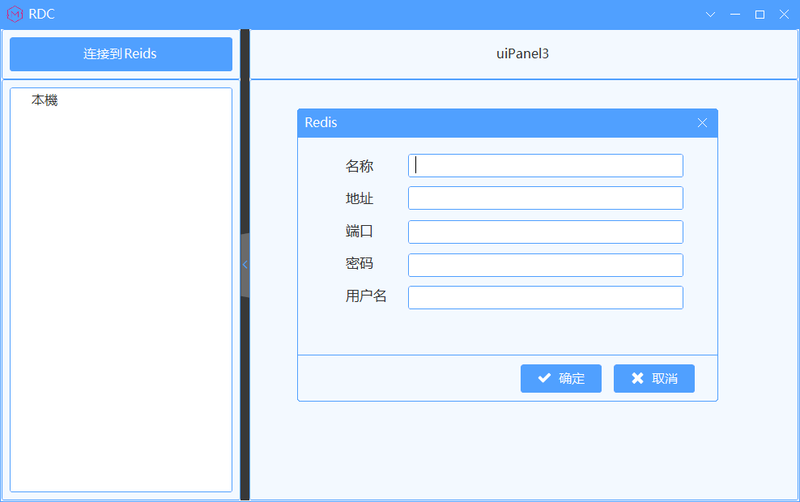
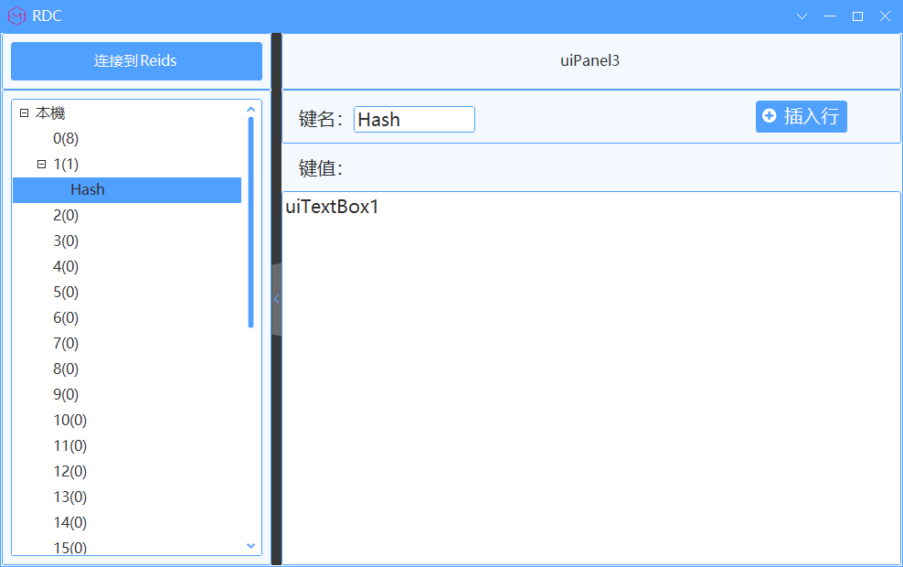
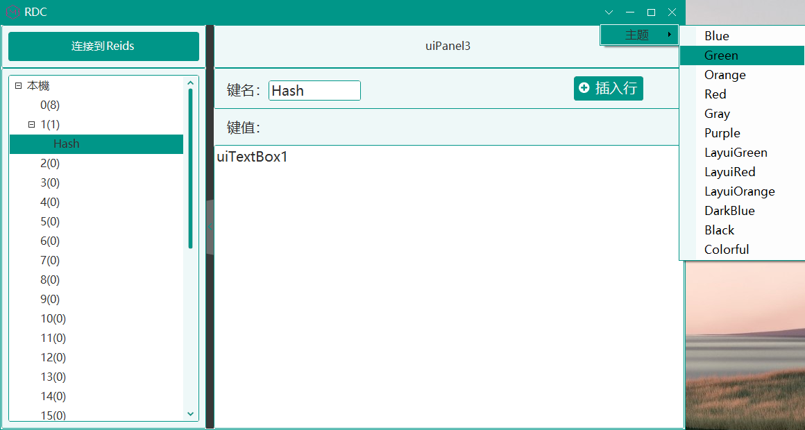

# RDC

#### 介绍
RDC 是基于.Net Framework 4.7.2 .Net 6 框架的 C# WinForm Redis 客户端。
UI 采用了SunnyUI
NuGet扩展包：Newtonsoft、StackExchange.Redis。

#### 安装教程
[Window系统安装包下载链接1](http://github.com/dengmuming/RDC/blob/main/RDC/RDC%20Client/Debug/RDC%20Client.msi)
[Window系统安装包下载链接2](http://gitee.com/dengmuming/rdc/blob/master/RDC/RDC%20Client/Debug/RDC%20Client.msi)

#### 使用说明

#### 参与贡献

1.  Fork 本仓库
2.  新建 Feat_xxx 分支
3.  提交代码
4.  新建 Pull Request
